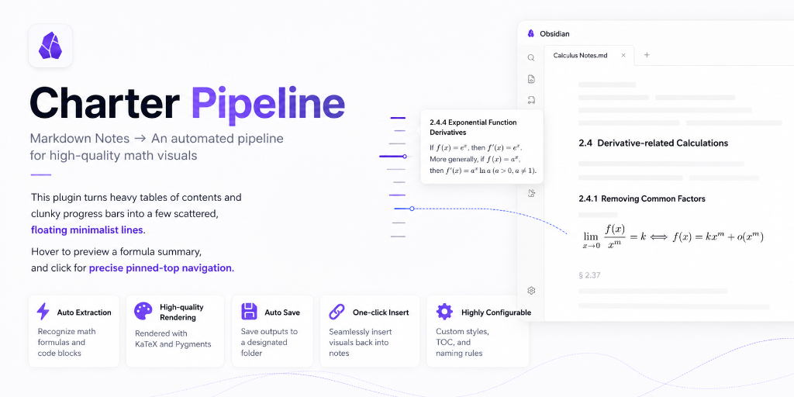
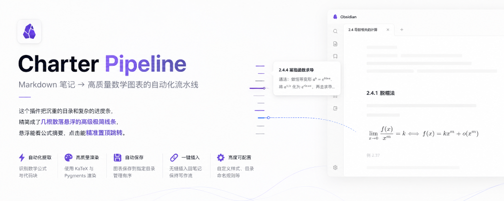

# 🪐 Charter Pipeline

**Minimalist Linear-style floating horizontal dash stepper for Obsidian with KaTeX formula preview & pinned-top navigation.**

*极简内嵌式 Linear 风格文章章节横线步进流导航插件：散落悬浮、LaTeX / KaTeX 公式预览、精准置顶跳转与分屏自适应隐藏。*

 

 

[English](#-english) • [简体中文](#-简体中文)

 

---

## 📖 English

### 🌟 Overview

> **💡 Core Concept**: Replaces bulky outline sidebars and noisy progress bars with a few elegant, floating minimalist dash lines — hover to preview KaTeX formula excerpts, click to smooth scroll & pin to the top.

**Charter Pipeline** brings the sleek, ultra-minimalist timeline navigation of **Linear** directly into Obsidian. 

Unlike traditional bulky sidebar trees or noisy full-text minimaps, Charter Pipeline renders a clean vertical series of **floating horizontal dash bars** on the left margin of your note. With proportional heading lengths, instant hover popovers with **KaTeX math previews**, and **two-pass pinned-top navigation**, navigating complex math and study notes has never been more effortless.

---

### ✨ Key Features

- 🪐 **Minimalist Linear-Style Floating Dashes**:
  - Pure floating horizontal lines on your note margin with zero container envelope background.
  - Distinct hierarchical dash lengths for headings: `H1` (16px), `H2` (12px), `H3` (9px), `H4~H6` (6px).
- 💬 **KaTeX Hover Tooltip & 3-Line Excerpt**:
  - Instant floating card centered pixel-perfect on the hovered dash line.
  - Bold wrapped chapter title + unbolded 3-line excerpt from section content.
  - Full native **LaTeX / KaTeX formula rendering** (`$f(x)$`, `$(uv)^{(n)}$`, etc.).
  - Automatic `...` ellipsis truncation for long text.
- 📌 **Pinned-Top Navigation (Rock-Solid Alignment)**:
  - Two-pass virtual coordinate calculation ensures clicking any heading lands it **consistently and stably at the very top of the viewport** (with 20px comfortable breathing space).
- 🚀 **120 FPS Hardware-Accelerated Scroll Tracking**:
  - Uses `requestAnimationFrame` with CodeMirror 6 active line detection.
  - Zero frame drops and zero CPU overhead even on 10,000-line math notes.
- 📱 **Split-Screen & Narrow View Auto-Hide**:
  - Automatically fades out when pane width is narrow (e.g. split-screen with PDF notes) so it never clashes with your text.
- ⚙️ **Rich Settings**:
  - Toggle 3-line excerpt preview, heading level filters (H1~H3 or H1~H6), ignore first H1 note title, custom active highlight colors (Azure Blue, Violet, Amber, Sakura Pink, Theme Accent).

---

### 🛠️ Installation

#### 1. Via Obsidian Community Plugins (Recommended)
1. Open **Settings** -> **Community Plugins**.
2. Search for **`Charter Pipeline`**.
3. Click **Install**, then **Enable**.

#### 2. Manual Installation
1. Download `main.js`, `manifest.json`, and `styles.css` from the latest [Release](https://github.com/LeaningLearner/obsidian-charter-pipeline/releases).
2. Extract or copy the files into `<YourVault>/.obsidian/plugins/chapter-pipeline/`.
3. Reload Obsidian (`Ctrl + R`) and enable **Charter Pipeline** in **Settings -> Community Plugins**.

---

### ⚙️ Settings Reference

| Setting | Description | Default |
| :--- | :--- | :--- |
| **开启正文 3 行摘要预览** | Toggle 3-line excerpt with KaTeX formulas below the title in the popover card. | `Enabled (true)` |
| **忽略文档首个一级大标题** | Ignores the very first `# Note Title` from generating a dash line. | `Disabled (false)` |
| **最大展示标题层级** | Filter deeper subheadings (e.g. H1~H2, H1~H3, H1~H6). | `H1 ~ H6` |
| **激活高亮横线颜色** | Color of active reading position (Azure Blue, Violet, Amber, Sakura, Theme). | `Azure Blue (#3b82f6)` |
| **分屏自动隐藏宽度阈值** | Minimum pane width in pixels before the stepper automatically hides. | `460px` |

---

 

## 🇨🇳 简体中文

  

 

### 🌟 插件简介

> **💡 一句话总结**：**把沉重的目录和复杂的进度条，精简成了几根散落悬浮的高级极简线条，悬浮能看公式摘要，点击能精准置顶跳转。**

**Charter Pipeline** 为 Obsidian 长文档与考研/学术笔记带来了 **Linear 的极简散落横线步进流** 美学。

区别于传统占用大量屏幕空间的臃肿侧边栏目录或信息杂乱的代码小地图，Charter Pipeline 在笔记左侧边缘渲染一列**纯净散落的悬浮横线条**。通过精巧的长短区分（H1~H6）、**支持 KaTeX 数学公式渲染的 3 行气泡卡片**、以及**像素级绝对置顶平滑跳转**，让长文浏览与章节检索变得优雅而极速。

---

### ✨ 核心特性

- 🪐 **Linear 级极简散落横线流**：
  - 纯粹自由散落悬浮在正文左侧，无厚重的外壳背景，还原纯粹原生质感；
  - 严格按标题层级长短区分：`H1`（16px）、`H2`（12px）、`H3`（9px）、`H4~H6`（6px）。
- 💬 **3 行 KaTeX 公式气泡与几何中心对齐**：
  - 悬浮横线即刻浮现独立气泡，**垂直正中心 100% 精准对齐短横线**；
  - 顶部为加粗且自动换行的章节名，下方为**浅色未加粗的 3 行正文摘要**；
  - 完整支持 **LaTeX / KaTeX 数学公式**（如 `$(uv)^{(n)}$`、$\lim$ 等）精美渲染，超长自动以 `...` 截断。
- 📌 **双阶段像素级绝对置顶跳转**：
  - 彻底攻克了虚拟滚动高度预估偏差导致的跳动问题；
  - 无论点击第 1 章还是第 30 章，**目标章节永远绝对稳定停靠在编辑器顶部（留出 20px 舒适间距）**。
- 🚀 **120 FPS 硬件加速滚动节流 (`requestAnimationFrame`)**：
  - 基于 CodeMirror 6 底层视口行号精确检测当前阅读位置；
  - 翻阅上万字、上百公式的长篇数学笔记时，依然保持 **0 掉帧、0 CPU 负担**。
- 📱 **分屏与窄屏自适应隐藏**：
  - 左边写笔记、右边开 PDF 双拼时，自动感应宽度并智能隐去，绝不遮挡正文内容。
- ⚙️ **丰富的个性化设置**：
  - 可选是否开启 3 行摘要预览、过滤展示层级（H1~H3 或全部）、忽略文档首个 H1 主标题、自定义高亮色系（默认天青蓝、紫罗兰、日落琥珀、樱花粉、主题强调色）。

---

### 🛠️ 安装方法

#### 1. 从 Obsidian 社区市场安装（推荐）
1. 打开 Obsidian **设置** -> **第三方插件** -> **社区插件市场**；
2. 搜索 **`Charter Pipeline`**；
3. 点击 **安装**，随后点击 **启用** 即可。

#### 2. 手动安装
1. 前往本仓库 [Releases 页面](https://github.com/LeaningLearner/obsidian-charter-pipeline/releases) 下载 `main.js`、`manifest.json` 与 `styles.css`；
2. 将这三个文件放置于笔记库的 `.obsidian/plugins/chapter-pipeline/` 目录下；
3. 在 Obsidian 中按 `Ctrl + R` 刷新，并在 **设置 -> 第三方插件** 中启用。

---

### ⚙️ 设置面板参数说明

| 配置项 | 功能说明 | 默认值 |
| :--- | :--- | :--- |
| **开启正文 3 行摘要预览** | 在气泡中换行展示正文开头的 3 行摘要（支持 KaTeX 公式）。关闭后仅展示纯净标题。 | `开启 (true)` |
| **忽略文档首个一级大标题** | 开启后，文章最开头的 `# 篇名` 不会生成横线，仅展示正文小节。 | `关闭 (false)` |
| **最大展示标题层级** | 过滤更深层级的子小节（如设为 H1~H3 则忽略 H4~H6）。 | `全部 H1 ~ H6` |
| **激活高亮横线颜色** | 自定义当前阅读章节的横线加亮颜色（天青蓝、紫罗兰、琥珀、樱花粉、主题色）。 | `天青蓝 (#3b82f6)` |
| **分屏自动隐藏宽度阈值** | 笔记窗口宽度小于该像素时自动隐藏横线流以防止遮挡。 | `460px` |

---

## 📄 License / 开源协议

本项目基于 [MIT License](LICENSE) 开源。  
Copyright (c) 2026 [择梦舟 (LeaningLearner)](https://github.com/LeaningLearner)
